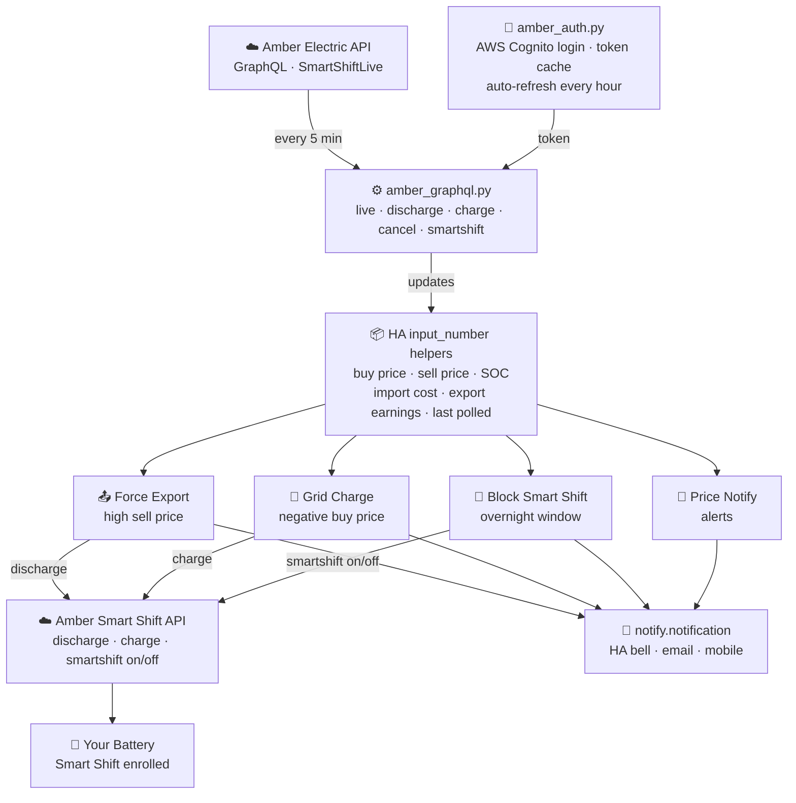
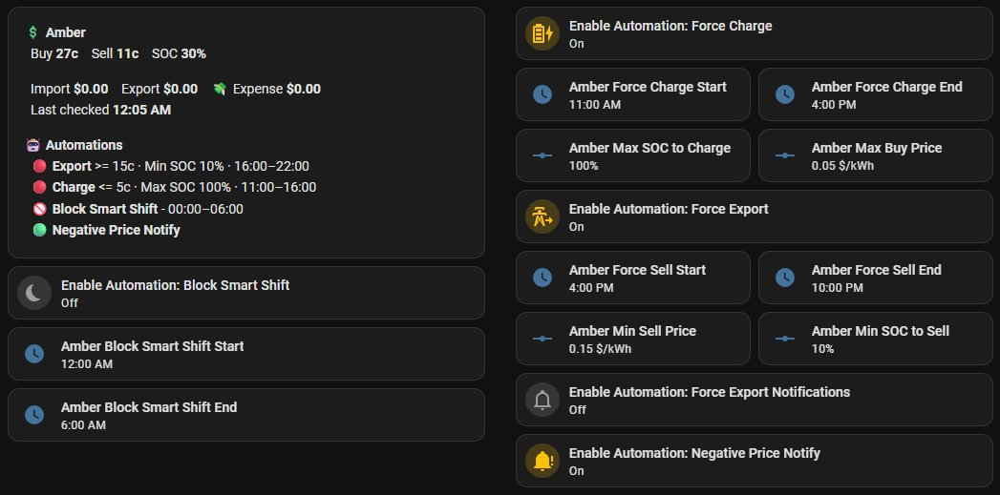

# hacs-custom-amber-integration

[](https://github.com/hacs/integration)
[](https://github.com/kane81/hacs-custom-amber-integration/releases)
[](https://opensource.org/licenses/MIT)

> **Home Assistant integration that connects to Amber Electric's Smart Shift API to automate battery charging, discharging and solar export based on real-time electricity prices.**



---

## 💡 Before You Start — Test in a Virtual Machine

If you are new to editing Home Assistant configuration files, it is strongly recommended to **set up a virtual machine running Home Assistant** before making changes to your live installation.

**[Setting up Home Assistant in a Virtual Machine](https://www.youtube.com/watch?v=GDlUzAsEO30)**

When configuring the VM network adapter use **Bridged Adapter** and **Paravirtualized Network (virtio-net)** — without this, downloads inside the VM can hang for 20+ minutes.

---

## 🚧 Early Beta — In Development

- Automations may behave unexpectedly in edge cases
- Breaking changes may occur between versions
- Monitor your system closely after installation
- Feedback welcome via [GitHub Issues](https://github.com/kane81/hacs-custom-amber-integration/issues)

---

## ⚠️ Prerequisites

- Active **Amber Electric** subscription with Smart Shift enabled
- **Smart Shift compatible battery** enrolled in the Amber app
- **Home Assistant OS or Supervised** with HACS installed
- Basic familiarity with Home Assistant

---

## ⚠️ Disclaimer

This project uses Amber Electric's internal API which is not publicly documented or officially supported. Amber may change or remove it at any time without notice. This project has no affiliation with Amber Electric. Use at your own risk — battery control actions directly affect your energy system and electricity costs. The author accepts no responsibility for energy costs, battery damage, or system issues.

---

## What It Does

| Feature | Description |
|---|---|
| **Price polling** | Fetches live Amber buy/sell prices every 5 minutes |
| **Force Export** | Discharges battery to grid when sell price exceeds your threshold |
| **Grid Charging** | Charges battery from grid when buy price goes negative |
| **Block Smart Shift** | Disables Smart Shift overnight to preserve battery for next day |
| **Price Notifications** | Alerts when buy price goes negative and when it recovers |

All optional automations are **off by default** — enable them individually from Settings → Helpers once you are confident the integration is working correctly.

---

## Installation

### Step 0 — Install Required Add-ons

Before starting you need two add-ons from the **official Home Assistant Add-on Store** — no HACS or third-party repositories required.

Open: **Settings → Add-ons → Add-on Store**

#### Studio Code Server — file editor

Used to edit `configuration.yaml` and `secrets.yaml` directly in your browser. Required for Steps 2 and 3.

1. Search for `Studio Code Server` → **Install**
2. Go to the **Info** tab → **Start**
3. Toggle **Show in sidebar** to on

#### Terminal & SSH — command line

Used to install pycognito, run the install script, and test authentication. Required for Steps 1, 4 and 5.

1. Search for `Terminal & SSH` → **Install**
2. Go to the **Configuration** tab → click **Show unused optional configuration options** → expand **ssh** → set a username and password — **this is required or the add-on will not start**
3. Go to the **Info** tab → **Start**
4. Toggle **Show in sidebar** to on

#### Verify Terminal works

Open **Terminal & SSH** from the sidebar and confirm you get a command prompt. That's all — python3 and pip3 are installed automatically by the install script in Step 1.

---

### Step 1 — Add via HACS

1. Open **HACS** in your HA sidebar
2. Click **⋮** (top right) → **Custom repositories**
3. Paste: `https://github.com/kane81/hacs-custom-amber-integration`
4. Category: **Integration** → **Add**
5. Search for **hacs-custom-amber-integration** → **Download**

HACS downloads the integration into `/config/custom_components/amber_integration/`.

**After every HACS install or update**, open **Terminal & SSH** and run the install script to copy files into their correct `/config/` locations:

```bash
bash /config/custom_components/amber_integration/install.sh
```

The script copies all automations, scripts, packages and templates, then checks your `configuration.yaml` for any missing lines and tells you exactly what to fix.

> **After this first run** the `amber_hacs_auto_install` automation is active and will run the install script automatically whenever you update the integration via HACS — you won't need to think about it again.

---

### Step 2 — Update configuration.yaml

Open **Studio Code Server** from the sidebar. In the file explorer on the left open `/config/configuration.yaml`.

Make sure these two lines are present — add any that are missing:

**1. Load automations from the automations folder:**
```yaml
automation: !include_dir_merge_list automations/
```

> If you already have `automation: !include automations.yaml` replace that line with the one above.

**2. Load the integration package (helpers, shell commands, notify):**
```yaml
homeassistant:
  packages: !include_dir_named packages/
```

> If you already have a `homeassistant:` section, add just the `packages:` line underneath it.

Save with **Ctrl+S** then restart HA: **Settings → System → Restart**

---

### Step 3 — Add Credentials

Still in **Studio Code Server**, open `/config/secrets.yaml` from the file explorer and add:

```yaml
amber_email: "your@email.com"
amber_password: "your-amber-password"
ha_long_lived_token: "your-long-lived-access-token"

# Optional — only needed if adding email notifications
smtp_username: "your@gmail.com"
smtp_password: "your-app-password"
```

Save with **Ctrl+S**.

**Getting your HA long-lived access token:**
1. Click your profile avatar (bottom left sidebar)
2. Scroll to **Long-Lived Access Tokens** → **Create Token**
3. Name it `amber_smartshift` — copy it immediately, it will not be shown again

---

### Step 4 — Test Authentication

```bash
python3 /config/scripts/amber_auth.py
```

Expected output:
```
Authenticating as your@email.com...
Authentication successful
Site ID:   01K...
Config ID: 01K...
Token cached successfully
```

Then test a live price poll:

```bash
python3 /config/scripts/amber_graphql.py live
```

Expected output:
```
Buy:    28.5c/kWh
Sell:   5.2c/kWh
HA updated. Last polled: 2026-04-08 10:30:00
```

---

### Step 5 — Restart HA

**Settings → System → Restart**

---

### Step 6 — Verify Automations

After restart go to **Settings → Automations** and confirm the following automations are listed:

| Automation | Expected state |
|---|---|
| Amber Auth on Startup | Enabled — runs on every HA restart |
| Amber Price Poller | Enabled — polls every 5 minutes |
| Amber Block Smart Shift Overnight | Listed — off by default |
| Amber Charge from Grid on Negative Buy Price | Listed — off by default |
| Amber Force Export at Custom FiT | Listed — off by default |
| Amber Negative Price Notification | Listed — off by default |
| Amber Integration - HACS Auto Install | Enabled — handles future updates |

If automations are missing, re-run the install script:
```bash
bash /config/custom_components/amber_integration/install.sh
```

#### ⚠️ Note on the Automation Editor

When you open an automation from **Settings → Automations** you may see a warning that the automation was created outside the UI and cannot be edited here. This is expected — automations stored in separate YAML files under `/config/automations/` appear as read-only in the GUI.

This is intentional. Keeping them as separate files means HACS updates automatically apply changes when you run the install script. If you accept the GUI's offer to migrate them into a single `automations.yaml` file you can then edit them in the UI, but future project updates will no longer apply to them automatically.

**Recommendation:** leave them as-is and edit via Studio Code Server if needed.

---

## Enabling Optional Automations

Optional automations are **off by default**. Enable them via **Settings → Helpers** when you are ready:

| Helper | Enables | Default |
|---|---|---|
| `amber_enable_block_smart_shift` | Block Smart Shift Overnight | OFF |
| `amber_enable_charge_on_negative_buy` | Grid Charge on Negative Buy Price | OFF |
| `amber_enable_force_export_custom_fit` | Force Export at Custom FiT | OFF |
| `amber_enable_negative_price_notify` | Negative Price Notification | OFF |

To toggle: go to **Settings → Helpers**, find the helper by name and click the toggle.

---

## Testing the Integration

Before enabling optional automations it is worth verifying the integration is working correctly end to end.

### Verify price polling is working

1. Go to **Settings → Automations** and confirm **Amber Price Poller** is listed
2. Go to **Developer Tools → States** and search for `amber_general_price_actual`
3. The state should show a current price value and `amber_last_polled` should show a recent timestamp
4. If values are 0 or stale, run manually in Terminal:
   ```bash
   python3 /config/scripts/amber_graphql.py live
   ```

### Test Smart Shift control (recommended before enabling automations)

This confirms your credentials are correct and the API can actually control your battery.

1. In Terminal, disable Smart Shift:
   ```bash
   python3 /config/scripts/amber_graphql.py smartshift_off
   ```
2. Open the **Amber app** on your phone → check that Smart Shift shows as **disabled**
3. Re-enable Smart Shift:
   ```bash
   python3 /config/scripts/amber_graphql.py smartshift_on
   ```
4. Check the Amber app again — Smart Shift should show as **enabled**

If both steps work correctly your credentials and API connection are good and it is safe to enable the automations.

### Enable your first automation

Start with just one automation to verify it behaves as expected before enabling others:

1. Go to **Settings → Helpers**
2. Find `amber_enable_negative_price_notify` and toggle it **ON**
3. This automation sends a notification when buy price goes negative — low risk, no battery control
4. Monitor it for a day or two before enabling the battery control automations

When you are ready to enable battery control:
- `amber_enable_force_export_custom_fit` — discharges battery at high sell prices
- `amber_enable_charge_on_negative_buy` — charges battery when buy price goes negative
- `amber_enable_block_smart_shift` — disables Smart Shift overnight

> ⚠️ Remember: all automation toggles reset to OFF every time HA restarts. You will need to re-enable them after each restart.

---

## Configuration

All settings can be changed without editing any YAML files. Changes to price thresholds take effect immediately — no restart needed.

### Option A — Overview → Devices & Services (recommended)

1. Go to your **Overview** dashboard
2. Click **Devices & Services** (top right corner button)
3. Select the **Helpers** tab
4. Search for the helper you want to change (e.g. `amber_min_sell_price`)
5. Click it and update the value

### Option B — Settings → Helpers

**Settings → Helpers** → find helper by name → click to edit.

### Time Windows

| Helper | Default | Purpose |
|---|---|---|
| `amber_charge_on_negative_start` | 10:00 | Start of negative price monitoring window |
| `amber_charge_on_negative_end` | 17:00 | End of negative price monitoring window |
| `amber_force_sell_on_custom_fit_start` | 16:00 | Start of force export window |
| `amber_force_sell_on_custom_fit_end` | 06:00 | End of force export window (overnight) |
| `amber_block_smart_shift_start` | 00:00 | Start of Smart Shift block window |
| `amber_block_smart_shift_end` | 06:00 | End of Smart Shift block window |

### Price Thresholds

| Helper | Default | Purpose |
|---|---|---|
| `amber_min_sell_price` | $0.15/kWh | Minimum sell price to trigger force export |
| `amber_min_soc_to_sell` | 10% | Minimum battery SOC before stopping export |

---

## Notifications

By default all notifications go to the **HA Notifications bell (🔔)** in the sidebar — no setup needed.

To add **email** or **mobile push**, open `/config/packages/amber.yaml` in Studio Code Server and uncomment the relevant blocks. The file has full instructions in the comments.

**Finding your mobile device service name:**
Open **Developer Tools → Actions** and search `notify.mobile_app` — you will see entries like `notify.mobile_app_your_device`.

---

## Dashboard Card

The dashboard card shows live Amber prices, current interval cost/earnings, and the status of all automations at a glance.



**Icon legend:** 🟢 enabled & active · 🔴 enabled, waiting for conditions · 🚫 disabled

### Adding the card

1. Go to **Settings → Dashboards**
2. Open the dashboard you want to add the card to (or create a new one with **Add Dashboard**)
3. Click the **pencil icon** (top right) to enter edit mode
4. Click **+ Add Card**
5. Scroll down and select **Markdown**
6. Delete any placeholder text in the content field
7. Paste the full template below
8. Click **Save**

```jinja
{# --- Amber Prices --- #}



{# --- Current Interval Cost/Earnings (cents → dollars) --- #}



{# --- Automation Thresholds --- #}



{# --- Time Windows (HH:MM only) --- #}






{# --- Automation Enable Flags --- #}




{# --- Automation Session State Flags --- #}



{# --- Icon logic: 🚫 disabled · 🟢 active · 🔴 enabled/waiting --- #}





**💲 Amber**
&nbsp;&nbsp;Buy **{{ (buy_price * 100) | round(0) | int }}c** &nbsp;&nbsp; Sell **{{ sell_display }}c** &nbsp;&nbsp; SOC **{{ soc | round(0) | int }}%**
&nbsp;&nbsp;Import **${{ (import_cost / 100) | round(2) }}** &nbsp;&nbsp; Export **${{ (export_earnings / 100) | abs | round(2) }}** &nbsp;&nbsp; {{ '💰 Credit **$' ~ (total_earnings / 100) | round(2) ~ '**' if total_earnings > 0 else '💸 Expense **$' ~ ((total_earnings / 100) | abs) | round(2) ~ '**' if total_earnings < 0 else '**$0.00**' }}
&nbsp;&nbsp;Last checked **{{ states('input_datetime.amber_last_polled') | as_timestamp | timestamp_custom('%I:%M %p') }}**

**🤖 Automations**
&nbsp;&nbsp;{{ ic_force_export }} **Force Export** — Min FiT {{ (min_sell_price * 100) | round(0) | int }}c · Min SOC {{ min_soc_to_sell | round(0) | int }}% · {{ fit_start }}–{{ fit_end }}
&nbsp;&nbsp;{{ ic_block_ss }} **Block Smart Shift** — Window {{ ss_block_start }}–{{ ss_block_end }}{{ ' · Active' if ss_blocked else '' }}
&nbsp;&nbsp;{{ ic_grid_charge }} **Grid Charge on Negative Buy** — Window {{ charge_start }}–{{ charge_end }}
&nbsp;&nbsp;{{ ic_neg_notify }} **Negative Price Notify** — Window {{ charge_start }}–{{ charge_end }}
```

---

## Manual Commands

These can be run from Terminal & SSH at any time:

```bash
python3 /config/scripts/amber_graphql.py status        # battery status and active overrides
python3 /config/scripts/amber_graphql.py live          # poll prices now
python3 /config/scripts/amber_graphql.py discharge 30  # force discharge for 30 minutes
python3 /config/scripts/amber_graphql.py charge 60     # force charge for 60 minutes
python3 /config/scripts/amber_graphql.py cancel        # cancel any active override
python3 /config/scripts/amber_graphql.py smartshift_on
python3 /config/scripts/amber_graphql.py smartshift_off
python3 /config/scripts/amber_auth.py                  # manually refresh auth token
```

---

## Troubleshooting

**Automations not appearing** — re-run the install script: `bash /config/custom_components/amber_integration/install.sh`. Confirm `automation: !include_dir_merge_list automations/` is in `configuration.yaml`, then restart HA.

**Auth fails on startup** — check `amber_email` and `amber_password` in `secrets.yaml`. Run `python3 /config/scripts/amber_auth.py` in Terminal to see the exact error.

**Prices not updating** — check the `Amber Price Poller` automation trace in Settings → Automations. Run `python3 /config/scripts/amber_graphql.py live` to test manually.

**Optional automation not firing** — confirm its enable boolean is ON in Settings → Helpers. Check the automation trace — the condition block shows exactly why it exited early.

**notify.notification unknown action error** — the package hasn't loaded yet. Reload: Developer Tools → YAML → Reload All.

**After any change to configuration.yaml** — Developer Tools → YAML → Reload All (or restart HA).

---

## License

MIT — see [LICENSE](LICENSE) file. Note the disclaimer above regarding the undocumented Amber API.

## Contributing

Issues and PRs welcome. Contributions should include testing against the current Amber app to verify API compatibility.
