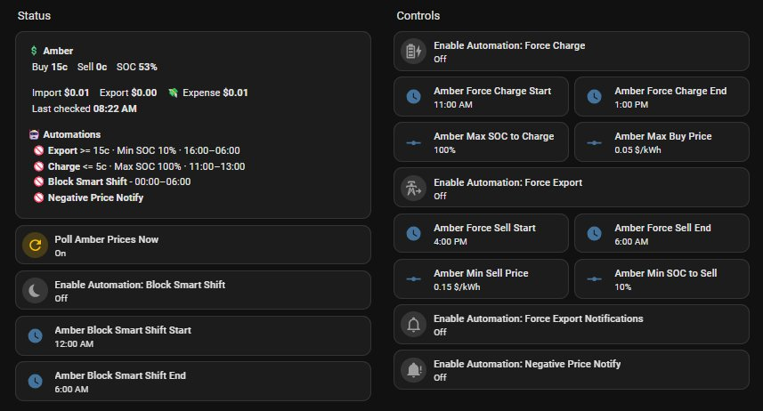

<p align="center"></p>

# Home Assistant Custom Amber Electric Integration

[](https://www.buymeacoffee.com/kane81)


[](https://github.com/hacs/integration)
[](https://github.com/kane81/hacs-custom-amber-integration/releases)
[](https://opensource.org/licenses/MIT)
[](https://analytics.home-assistant.io)

> A Home Assistant custom integration for **[Amber Electric](https://www.amber.com.au/)** that automates battery charging, discharging and solar export based on real-time electricity prices via the Smart Shift API.

> **Battery agnostic** — works with any battery enrolled in Amber Smart Shift. The integration controls the battery via the Amber API, not directly, so no local battery connection is required.

> ☀️ **Have a GoodWe solar inverter?** Add automatic solar curtailment when prices are negative with the companion project: [hacs-goodwe-sems-curtailment](https://github.com/kane81/hacs-goodwe-sems-curtailment)

📐 [Click here to view the Architecture Diagram](images/architecture.png)

---


## Features

| Feature | Description |
|---|---|
| **Price polling** | Fetches live Amber buy/sell prices every 5 minutes |
| **Force Export** | Discharges battery to grid when sell price exceeds your threshold |
| **Grid Charging** | Charges battery from grid when buy price goes negative |
| **Block Smart Shift** | Disables Smart Shift overnight to preserve battery for next day |
| **Price Notifications** | Alerts when buy price goes negative and when it recovers |
| **Battery Offline Detection** | Detects when Amber cannot communicate with the battery — notifies once when offline and again when restored. Shows a warning on the dashboard card. |

All optional automations are **off by default** — enable them individually via the dashboard card or Overview → Devices → Helpers once you are confident the integration is working correctly.

---


## ⚠️ Disclaimer

This project uses Amber Electric's internal API which is not publicly documented or officially supported. Amber may change or remove it at any time without notice. This project has no affiliation with Amber Electric. Use at your own risk — battery control actions directly affect your energy system and electricity costs. The author accepts no responsibility for energy costs, battery damage, or system issues.

### New to Home Assistant?

If you are new to editing Home Assistant configuration files it is strongly recommended to test in a virtual machine before making changes to your live installation.

**[Setting up Home Assistant in a Virtual Machine](https://www.youtube.com/watch?v=GDlUzAsEO30)**

When configuring the VM network adapter use **Bridged Adapter** and **Paravirtualized Network (virtio-net)** — without this, downloads inside the VM can hang for 20+ minutes.

---


## ⚠️ Prerequisites

- Active **Amber Electric** subscription with Smart Shift enabled
- **Smart Shift compatible battery** enrolled in the Amber app
- **Home Assistant OS or Supervised** with HACS installed
- Basic familiarity with Home Assistant

### Have on hand before starting

Have these ready to copy and paste during the install:

| What | Where to get it |
|---|---|
| **Amber login email** | Your Amber Electric account email |
| **Amber password** | Your Amber Electric account password |
| **HA Long-Lived Access Token** | In HA: click your **Profile avatar** (bottom left) → **Long-Lived Access Tokens** → **Create Token** → give it a name → copy the token |
| **Email address** *(optional)* | Your email address for notifications |
| **SMTP server** *(optional)* | e.g. `smtp.gmail.com` for Gmail, `smtp.office365.com` for Outlook. Press Enter during install to default to Gmail. |
| **SMTP password** *(optional)* | For Gmail: [create an App Password](https://myaccount.google.com/apppasswords) (requires 2FA enabled). For other providers check your email settings. |

---


## Installation

### Step 1 — Install Prerequisites

#### Install HACS (if not already installed)

HACS (Home Assistant Community Store) is required to install this integration. If it is already in your sidebar, skip ahead to Step 0b.

1. Go to **Settings → Apps → Install Apps**
2. Click **⋮** (top right) → **Custom repositories**
3. Paste: `https://github.com/hacs/addons` → Category: **Add-on** → **Add**
4. Search for **HACS** → **Install**
5. Go to the **Info** tab → **Start** → **Restart Home Assistant** when prompted
6. After restart go to **Settings → Devices & Services → Add Integration**
7. Search for **HACS** → follow the setup steps (requires a GitHub account)
8. Once configured, **HACS** will appear in your left sidebar

#### Step 1b — Install Advanced SSH & Web Terminal

You need the Advanced SSH & Web Terminal add-on to run the install script.

1. Go to **Settings → Apps → Install Apps**
2. Search for `Advanced SSH & Web Terminal` → **Install**
3. Go to the **Info** tab → **Start**
4. Toggle **Show in sidebar** to on

---

### Step 2 — Install Custom Amber Project

Click the button below to add the repository to HACS:

[](https://my.home-assistant.io/redirect/hacs_repository/?owner=kane81&repository=hacs-custom-amber-integration&category=integration)

Or add manually:
1. Open **HACS** in your HA sidebar
2. Click **⋮** (top right) → **Custom repositories**
3. Paste: `https://github.com/kane81/hacs-custom-amber-integration`
4. Category: **Integration** → **Add**
5. Search for **hacs-custom-amber-integration** → **Download**

HACS downloads the integration into `/config/custom_components/amber_integration/`.

**Open Advanced SSH & Web Terminal and run the install script:**

```bash
bash /config/custom_components/amber_integration/install.sh
```
> 💡 **Terminal tip:** To paste into the terminal use **Right Click → Paste**. Do not use Ctrl+V — it will not work in the HA terminal.


The script will walk you through the following steps:

**1. Credentials**

You will be prompted for your credentials — have these ready before running:
- Your HA Long-Lived Access Token — get it from your **profile avatar** (bottom left) → **Long-Lived Access Tokens** → **Create Token** → copy it immediately
- Your Amber Electric login email and password

```
🔑 Checking credentials in secrets.yaml...

   Enter Amber Electric login email: you@example.com
   ✅ amber_email saved to secrets.yaml

   Enter Amber Electric login password: ••••••••
   ✅ amber_password saved to secrets.yaml

   Enter HA Long-Lived Access Token: eyJ...
   ✅ ha_long_lived_token saved to secrets.yaml
```

**2. Email notifications (optional)**

```
📧 Email Notifications (optional)
   Notifications go to the HA bell by default.
   To also receive email alerts enter your SMTP details.

   Set up email notifications now? (y/N): 
```

Answer **y** if you want email alerts, or press Enter to skip — you can add this later via the **Email Notifications** section below.

**3. Configuration and defaults**

The script automatically updates `configuration.yaml`, reloads HA YAML and sets default helper values. No action required — just wait for it to complete.

**3. Dashboard card**

The script automatically creates `lovelace/amber.yaml` with the dashboard card pre-configured, and adds the lovelace dashboard entry to `configuration.yaml`. After restarting HA, an **Amber** dashboard will appear in your sidebar ready to use.

**4. Verify completion**

The output should end with:
```
✅ Install complete!
```

> **After this first run** the `amber_hacs_auto_install` automation handles all future HACS updates automatically.

> **On every HA restart** the automation runs a lightweight sync (copies files only) — no prompts, no pip installs. Your settings are never touched.

> **To re-run the full installer** at any time (e.g. to set up email, reconfigure credentials, or re-add the dashboard card):
> ```bash
> bash /config/custom_components/amber_integration/install.sh
> ```

---

### Step 4 — Dashboard Card

The dashboard card shows live Amber prices, current interval cost/earnings, and the status of all automations at a glance.



**Icon legend:** 🟢 enabled & active · 🔴 enabled, waiting for conditions · 🚫 disabled · ⚠️ blocked


---

## Using the Dashboard Card


If you opted to install the dashboard during setup, there will be an **Amber** dashboard in your sidebar. Click on it to see your controls. Click **Poll Amber Prices Now** to load the current info from Amber — data will be at default settings until the first poll runs.

If you did not opt to auto install, see the manual instructions below.

---

### Manually Adding the Card

> **Note:** Recent HA versions only support Entities cards on Overview — Markdown cards require a custom dashboard. Create one first: **Settings → Dashboards → Add Dashboard → New dashboard from scratch**.

The install script creates a new **Amber** dashboard and adds the card automatically — answer **Y** when prompted. To add it manually or to a different dashboard:

1. Go to your dashboard → click **⋮** → **Edit dashboard**
2. Click **+ Add Card** → search for and select **Markdown**
3. Copy the card template from [`custom_components/amber_integration/dashboard_card.txt`](custom_components/amber_integration/dashboard_card.txt) and paste into the Content field
4. Click **Save**

To add automation toggles and config controls to the same dashboard, add an **Entities** card for each group in the **Configuring the Amber Integration Using the Dashboard Card** section below.

Add toggle and number controls directly to your dashboard so you can control automations and adjust settings without navigating to Helpers. The automations in **Settings → Automations** should always remain enabled — control is via the **Enable Automation** toggles. When OFF, the automation runs but exits immediately without doing anything.

For each group below, add an **Entities** card and include the listed entities.

> **Tip:** You can adjust the width of entity cards in edit mode — click the card → drag the resize handle, or use **Layout** options to set columns.


---

Below explains the automations and configuration options of the Custom Amber Integration.

**Price Poller**
- `Amber Price Poller` — polls every 5 minutes and 30 seconds to get actual pricing rather than an estimate

---

**Block Smart Shift** — disables Smart Shift overnight to preserve battery charge for peak periods
- `Enable Automation: Block Smart Shift`
- `Amber Block Smart Shift Start`
- `Amber Block Smart Shift End`

---

**Force Export** — discharges battery to grid when sell price is at or above your threshold
- `Enable Automation: Force Export`
- `Amber Min Sell Price` — minimum sell price to trigger export
- `Amber Min SOC to Sell` — minimum battery % before stopping export
- `Amber Force Sell Start`
- `Amber Force Sell End`

---

**Force Charge** — charges battery from grid when buy price is at or below your threshold; cancels override at max SOC returning to self-consumption
- `Enable Automation: Force Charge`
- `Amber Max Buy Price` — maximum buy price to trigger charging
- `Amber Max SOC to Charge` — stop charging at this battery %
- `Amber Force Charge Start`
- `Amber Force Charge End`

---

**Notifications**
- `Enable Automation: Force Export Notifications` — notifications when force export starts, stops or fails
- `Enable Automation: Negative Price Notify` — notification when buy price goes negative

---

#### ⚠️ Note on the Automation Editor

When you open an automation from **Settings → Automations** you may see a warning that the automation was created outside the UI and cannot be edited here. This is expected — automations stored in YAML files under `/config/automations/` appear as read-only in the GUI. Leave them as-is.

---


## Manual Commands

These can be run from Advanced SSH & Web Terminal at any time:

```bash
python3 /config/scripts/amber_graphql.py status        # battery status and active overrides
python3 /config/scripts/amber_graphql.py live          # poll prices now
python3 /config/scripts/amber_graphql.py discharge 30  # force discharge for 30 minutes
python3 /config/scripts/amber_graphql.py charge 60     # force charge for 60 minutes
python3 /config/scripts/amber_graphql.py cancel        # cancel any active override
python3 /config/scripts/amber_graphql.py smartshift_on
python3 /config/scripts/amber_graphql.py smartshift_off
python3 /config/scripts/amber_auth.py                  # manually refresh auth token
```

## Email Notifications

By default all notifications go to the HA notification bell (🔔) in the top right of the UI. You can optionally have them emailed to you as well.

**What you will need:**
- Your email address
- Your email password or app password — Gmail requires an [App Password](https://myaccount.google.com/apppasswords) if you have 2FA enabled

> You can always add this later — notifications will continue going to the HA bell in the meantime.

### Set up during install (recommended)

Answer **y** when the install script asks about email notifications — it will prompt for your credentials, update `secrets.yaml`, automatically uncomment the SMTP block in `amber.yaml` and reload HA YAML. No manual steps needed.

### Set up manually

**Step 1 — Add credentials to secrets.yaml**

Open `/config/secrets.yaml` in an editor and add:

```yaml
smtp_username: "your@gmail.com"
smtp_password: "your-app-password"
```

**Step 2 — Uncomment the email notify block in amber.yaml**

Open `/config/packages/amber.yaml` and uncomment the SMTP section near the bottom:

```yaml
  - name: amber_smtp
    platform: smtp
    server: smtp.gmail.com
    port: 587
    timeout: 15
    sender: !secret smtp_username
    encryption: starttls
    username: !secret smtp_username
    password: !secret smtp_password
    recipient:
      - "your@gmail.com"
    sender_name: "Home Assistant - Amber"
```

**Step 3 — Add amber_smtp to the notification group**

In the same file find the `notify:` group and add `amber_smtp`:

```yaml
notify:
  - name: notification
    platform: group
    services:
      - service: persistent_notification
      - service: amber_smtp   # ← add this line
```

**Step 4 — Reload YAML**

**Developer Tools → YAML → Reload All**

> If you ran the full install script after making these changes it reloads automatically — no manual reload needed.

All future notifications will now go to both the HA bell and your email.

---

## Uninstalling

Removing this integration via HACS only deletes the `custom_components` folder — automation files, packages, scripts and helpers are left behind. To fully remove everything run the uninstall script first:

```bash
bash /config/custom_components/amber_integration/uninstall.sh
```

Then remove from HACS and restart HA.

## Troubleshooting

**Automations not appearing** — re-run the install script: `bash /config/custom_components/amber_integration/install.sh`. Confirm `automation: !include_dir_merge_list automations/` is in `configuration.yaml`, then restart HA.

**Auth fails on startup** — check `amber_email` and `amber_password` in `secrets.yaml`. Run `python3 /config/scripts/amber_auth.py` in Terminal to see the exact error.

**Prices not updating** — check the `Amber Price Poller` automation trace in Settings → Automations. Run `python3 /config/scripts/amber_graphql.py live` to test manually.

**Optional automation not firing** — confirm its enable toggle is ON in Overview → Devices → Helpers. Check the automation trace — the condition block shows exactly why it exited early.

**notify.notification unknown action error** — the package hasn't loaded yet. Reload: Developer Tools → YAML → Reload All.

**After any change to configuration.yaml** — Developer Tools → YAML → Reload All (or restart HA).

---

## License

MIT — see [LICENSE](LICENSE) file. Note the disclaimer above regarding the undocumented Amber API.

## Contributing

Issues and PRs welcome. Contributions should include testing against the current Amber app to verify API compatibility.

---

## Credits

- **[Official Amber Electric Integration](https://www.home-assistant.io/integrations/amberelectric/)** — the official HA integration this project complements
- Thanks to **hudakh**, **chrismalec87**, 6minchinbury, **Jacob Kairl** and the rest of the beta testers for their invaluable feedback and testing.
