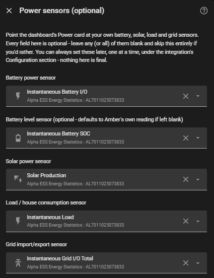
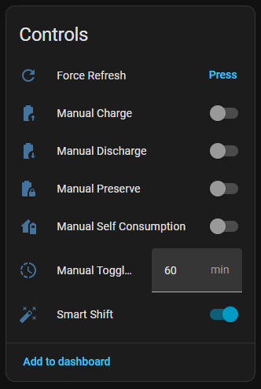
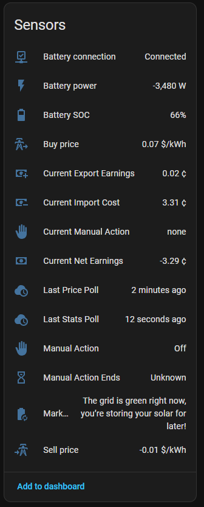
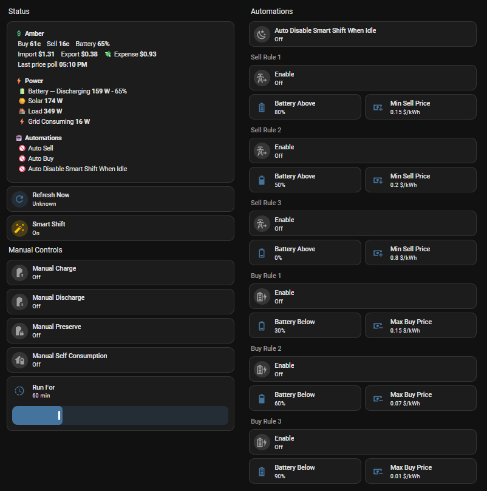

<p align="center"></p>

# HA Custom Amber Electric Integration

Control your home battery from Home Assistant using [Amber Electric](https://www.amber.com.au/)'s Smart Shift API — live prices, manual charge/discharge, and optional price-triggered automations.

> **This is not the official Amber Electric integration.** Home Assistant's built-in integration provides price sensors only and cannot control a battery. This project uses the same private API as the Amber mobile app, which is where battery control is implemented.

☀️ Have a GoodWe solar inverter? Add automatic solar curtailment when prices are negative with the companion project: [hacs-goodwe-sems-curtailment](https://github.com/kane81/hacs-goodwe-sems-curtailment)

---

## How It Works

The integration authenticates with your Amber email and password, the same credentials used by the mobile app. Every control action it exposes — charge, discharge, preserve, self-consume, or Smart Shift on/off — sends Amber the same instruction the app would send.

📐 [Click here to view the Architecture Diagram](https://github.com/kane81/hacs-custom-amber-integration/blob/main/images/architecture.png)

---

## What You Get

### Part 1 — The Integration (required)

Live prices and battery telemetry as sensors, plus manual controls: charge, discharge, preserve, self-consume, and a Smart Shift on/off switch. Configured entirely through the Home Assistant UI with an Amber account login.

### Part 2 — Automations and Dashboard (optional)

Three ready-made automations installed as blueprints, plus a dashboard. Trades automatically on price, with up to three battery-level rules per direction.

|                      | Part 1                           | Part 2                        |
| -------------------- | --------------------------------- | ------------------------------ |
| **What it is**       | A normal HA integration          | Blueprints + a dashboard file |
| **Install via**      | HACS → restart → Add Integration | One shell command             |
| **You need**         | Amber email + password           | Nothing extra                 |
| **Required?**        | Yes                               | No — Part 1 works standalone  |
| **Optional extras**  | Battery Level, Battery Power, Solar Power, Home Load Power and Grid Power sensors, for the dashboard's Power card | — |

---

## Requirements

- An **Amber Electric** account with **Smart Shift** enabled
- A **Smart Shift compatible battery**, already working in the Amber app
- **Home Assistant 2024.4** or newer, with [HACS](https://hacs.xyz/) installed
- A **terminal client** — Advanced SSH & Web Terminal add-on, or `docker exec` — required for Part 2's `install.sh` and the standalone script
- *Optional* — Battery Level, Battery Power, Solar Power, Home Load Power and Grid Power sensors, to populate the dashboard's Power card. See [Power sensors](#power-sensors) in the appendix for details.

---

## Part 1 — Install the Integration

### 1. Add the repository to HACS

[](https://my.home-assistant.io/redirect/hacs_repository/?owner=kane81&repository=hacs-custom-amber-integration&category=integration)

Or manually: **HACS** → **⋮** → **Custom repositories** → paste `https://github.com/kane81/hacs-custom-amber-integration` → Category **Integration** → **Add**.

### 2. Download it

In HACS, find *HA Custom Amber Electric Integration* and click *Download*.

This copies files to `/config/custom_components/amber_integration/`. Nothing is active yet.

### 3. Restart Home Assistant

**Settings → System → Restart**

Required — Home Assistant only discovers newly downloaded integrations on startup.

### 4. Add the integration and sign in

**Settings → Devices & Services → + Add Integration** → search **Amber**

> ⚠️ **Two results will appear.** Select *HA Custom Amber Electric Integration* — identified by the **Custom** badge. The other result is Home Assistant's built-in Amber Electric integration, which provides pricing data only.

Enter the email and password used for the Amber mobile app. The site and battery are detected automatically.

#### Power sensors (optional step)

The **Power sensors** screen configures the dashboard's Power card to reference existing solar, load, and grid sensors. The integration receives battery data through Amber's API only; it has no visibility into other inverter or metering data.



All fields are optional. Click **Submit** to skip this step, or complete only the fields available. Fields can be configured later from the integration's Configuration page.

On completion, a device named **Amber Smart Shift** is created, containing every entity and service this integration provides. See the [Entities](#entities) appendix for the complete list, including notes on units and sign conventions.

<p align="center">
  
  &nbsp;&nbsp;
  
</p>

---

## Part 2 — Automations and Dashboard (optional)

Part 1 must be installed and signed in first.

### Install

From **Advanced SSH & Web Terminal**, or `docker exec -it homeassistant bash`:

```
bash /config/custom_components/amber_integration/install.sh
```

The installer installs the blueprints and creates automations from them, using Part 1's entities. It prompts for automatic or manual dashboard installation, and removes files from earlier versions of this project if present.

**Everything is installed switched off.** Each automation checks its own enable switch before acting, so nothing affects the battery until enabled.

### The dashboard



The status panel reports what each automation is doing:

```
🤖 Automations
  🟢 Auto Sell — Battery > 80%, selling at 42c
  🔴 Auto Buy — Battery < 60%, buying when price <= 7c
  🚫 Auto Disable Smart Shift When Idle
```

🟢 acting now · 🔴 enabled, waiting for the price · 🚫 no rules enabled

Each Sell and Buy rule has its own card below the status panel, showing its battery threshold, price threshold, and enable switch — the same values described in [How the rules work](#how-the-rules-work), editable directly from the dashboard. An optional **Power** card appears once at least one Power sensor is configured, and shows an estimated time to full while charging, based on the live charge rate and Battery Capacity.

**Auto-installed dashboards cannot be edited in the UI.** `install.sh` registers it as a `mode: yaml` dashboard, which Home Assistant deliberately makes read-only in the frontend — no edit pencil, no drag-and-drop, no raw config editor. Changes require editing `/config/lovelace/amber.yaml` directly and reloading. Re-running `install.sh` overwrites it with the shipped version, including any manual edits.

### The three automations

**Auto Sell** discharges to the grid when the price is high enough. **Auto Buy** charges from the grid when the price is low enough. **Auto Disable Smart Shift When Idle** turns Smart Shift off whenever neither is running, preventing Amber's own plan from dispatching the battery independently, and restores it when the automation is disabled.

### How the rules work

Auto Sell and Auto Buy each have **three independent rules** — no time windows, on/off only, applied by battery level:

|             | Battery   | Only sell at/above |
| ----------- | --------- | ------------------- |
| Sell Rule 1 | above 80% | 15c                  |
| Sell Rule 2 | above 50% | 20c                  |
| Sell Rule 3 | above 0%  | 80c                  |

The fuller the battery, the lower the price required to sell. Buy mirrors this — the emptier the battery, the higher the price accepted:

|            | Battery   | Only buy at/below |
| ---------- | --------- | ------------------- |
| Buy Rule 1 | below 30% | 15c                  |
| Buy Rule 2 | below 60% | 7c                   |
| Buy Rule 3 | below 90% | 1c                   |

**Rule order is not significant.** At 90% battery, every Sell rule's condition is technically satisfied, so the automation selects the **most specific** one — the highest `battery above` threshold still met. Buy uses the lowest `battery below`. This is a comparison of values, not a sequential check, so rule placement does not affect behaviour. Disabled rules are skipped. Rules can be enabled or adjusted under **Settings → Devices & Services → HA Custom Amber Electric Integration →** the device **→ Configuration**, or via the same switches on the dashboard above.

### Manually adding the card

Building the dashboard manually allows full customisation in the HA Dashboard UI editor — cards can be reordered, restyled, or supplemented with additional controls. The trade-off is the absence of the live price summary and countdown timer, which rely on a Jinja template the Entities/Tile card types cannot reproduce.

**Setup:**

1. **Settings → Dashboards → + Add Dashboard** → *New dashboard from scratch* → provide a name
2. Open it → **Edit Dashboard**
3. Rename the first section to *Status*. Add a card → **Markdown**, and paste in the content from [`status_card.txt`](custom_components/amber_integration/status_card.txt) → **Save**

**Status section — add these as Tile cards, in order:**

| Entity | Tile name | Settings |
| --- | --- | --- |
| `button.amber_smart_shift_force_refresh` | Refresh Now | Hide entity state; Layout: Full width |
| `switch.amber_smart_shift_enable_smart_shift` | Smart Shift | Layout: Full width |
| *(heading card)* | Manual Controls | — |
| `switch.amber_smart_shift_manual_charge` | Manual Charge | Layout: Full width |
| `switch.amber_smart_shift_manual_discharge` | Manual Discharge | Layout: Full width |
| `switch.amber_smart_shift_manual_preserve` | Manual Preserve | Layout: Full width |
| `switch.amber_smart_shift_manual_self_consumption` | Manual Self Consumption | Layout: Full width |
| `number.amber_smart_shift_manual_toggle_duration` | Run For | Features → Add Feature → Numeric Input → style Slider; Layout: Full width |

**Automations section — add a second section (same as step 3, without the Markdown card), then add these as Tile cards:**

| Entity | Tile name | Settings |
| --- | --- | --- |
| `switch.amber_smart_shift_auto_disable_smart_shift_when_idle` | Auto Disable Smart Shift When Idle | Layout: Full width |
| *(heading card)* | Sell Rule 1 | — |
| `switch.amber_smart_shift_enable_sell_rule_1` | Enable | Layout: Full width |
| `number.amber_smart_shift_sell_rule_1_battery_above` | Battery Above | — |
| `number.amber_smart_shift_sell_rule_1_min_price` | Min Sell Price | — |
| *(heading card)* | Sell Rule 2 | — |
| `switch.amber_smart_shift_enable_sell_rule_2` | Enable | Layout: Full width |
| `number.amber_smart_shift_sell_rule_2_battery_above` | Battery Above | — |
| `number.amber_smart_shift_sell_rule_2_min_price` | Min Sell Price | — |
| *(heading card)* | Sell Rule 3 | — |
| `switch.amber_smart_shift_enable_sell_rule_3` | Enable | Layout: Full width |
| `number.amber_smart_shift_sell_rule_3_battery_above` | Battery Above | — |
| `number.amber_smart_shift_sell_rule_3_min_price` | Min Sell Price | — |
| *(heading card)* | Buy Rule 1 | — |
| `switch.amber_smart_shift_enable_buy_rule_1` | Enable | Layout: Full width |
| `number.amber_smart_shift_buy_rule_1_battery_below` | Battery Below | — |
| `number.amber_smart_shift_buy_rule_1_max_price` | Max Buy Price | — |
| *(heading card)* | Buy Rule 2 | — |
| `switch.amber_smart_shift_enable_buy_rule_2` | Enable | Layout: Full width |
| `number.amber_smart_shift_buy_rule_2_battery_below` | Battery Below | — |
| `number.amber_smart_shift_buy_rule_2_max_price` | Max Buy Price | — |
| *(heading card)* | Buy Rule 3 | — |
| `switch.amber_smart_shift_enable_buy_rule_3` | Enable | Layout: Full width |
| `number.amber_smart_shift_buy_rule_3_battery_below` | Battery Below | — |
| `number.amber_smart_shift_buy_rule_3_max_price` | Max Buy Price | — |

The two Number tiles per rule are left at default width so they sit side by side; only the Enable switch uses Full width. This matches the auto-installed dashboard's layout and naming exactly. `custom_components/amber_integration/dashboard_card.txt` contains the complete entity list as a plain checklist, for reference in place of the tables above.

---

## Troubleshooting

**The integration doesn't appear in Add Integration** — Home Assistant was not restarted after downloading from HACS, or the download failed. Check that `/config/custom_components/amber_integration/manifest.json` exists.

**"Entity not found" on the dashboard** — The dashboard version does not match the installed integration version. Update via HACS, re-run `install.sh`, and restart.

**An automation isn't doing anything** — Confirm its enable switch is on. Check the dashboard status line: 🔴 indicates the automation is enabled but the price has not met the configured threshold, which is expected behaviour.

**Battery shows offline** — `binary_sensor.…_battery_connection` reflects Amber's own reported status. If Amber cannot reach the battery, this integration cannot either — check the Amber app first.

**Smart Shift turned itself back on unexpectedly** — Any override re-enables Smart Shift if it was off, including Auto Buy/Auto Sell acting on their own price rules, not only a manual toggle. If Auto Disable Smart Shift When Idle had just turned it off and Auto Buy's conditions became true shortly after, this is expected — charging on a satisfied rule takes priority over remaining idle. Check `sensor.…_current_manual_action`'s `source` attribute to identify what applied it.

**Custom sensors are slow to update** — A lagging Power card reflects the poll rate of the source sensor integration, not this one. Check **Settings → Devices & Services → [the relevant battery/inverter integration] → ⚙️** and reduce its refresh interval.

---

## Uninstalling

**Part 2 only:**

```
bash /config/custom_components/amber_integration/uninstall.sh
```

Removes the blueprints, their automations, and the dashboard. Rules and thresholds are preserved, as they are entities on the integration itself.

**Part 1:** Settings → Devices & Services → *HA Custom Amber Electric Integration* → ⋮ → **Delete**, then remove the repository from HACS.

---

## Appendix

### Entities

#### Live data

| Entity                                           | What it is                                                         |
| ------------------------------------------------ | ------------------------------------------------------------------ |
| `sensor.…_buy_price`                             | Current general usage price ($/kWh)                                |
| `sensor.…_sell_price`                            | Current feed-in price ($/kWh) — negative means exporting incurs a cost |
| `sensor.…_battery_level`                         | Battery charge (%)                                                 |
| `sensor.…_battery_power`                         | Battery power (W) — negative while charging                        |
| `sensor.…_battery_capacity`                      | Total usable battery capacity (Wh) — from Amber, not a live reading; effectively static |
| `sensor.…_current_import_cost`                   | Import cost this 5-minute interval (¢)                             |
| `sensor.…_current_export_earnings`               | Export earnings this interval (¢)                                  |
| `sensor.…_current_net_earnings`                  | Net for this interval (¢)                                          |
| `sensor.…_market_state`                          | Amber's own description of current battery activity                |
| `binary_sensor.…_battery_connection`             | Off when Amber cannot reach the battery                            |
| `sensor.…_last_price_poll` / `…_last_stats_poll` | Timestamp of the last successful poll                              |

#### Manual control

| Entity                             | What it does                                                                                                                   |
| ----------------------------------- | ------------------------------------------------------------------------------------------------------------------------------ |
| `switch.…_manual_charge`           | Charge from the grid                                                                                                           |
| `switch.…_manual_discharge`        | Discharge to the grid                                                                                                          |
| `switch.…_manual_preserve`         | Hold current charge                                                                                                            |
| `switch.…_manual_self_consumption` | Solar charges, house load discharges, Smart Shift stays out of it                                                              |
| `number.…_manual_toggle_duration`  | Duration of the next toggle (5 min – 4 hours)                                                                                  |
| `switch.…_enable_smart_shift`      | Amber's own Smart Shift optimisation, on/off                                                                                   |
| `button.…_force_refresh`           | Polls immediately                                                                                                              |
| `sensor.…_current_manual_action`   | Which override is running, or `none`. Has a `source` attribute identifying what applied it (`manual`, `auto_sell`, `auto_buy`, `service`) |
| `sensor.…_manual_action_ends`      | Expiry time — renders as a live countdown                                                                                      |
| `binary_sensor.…_manual_action`    | On while any override is running                                                                                               |

The four manual switches are mutually exclusive — only one override can exist on Amber's side, so enabling one disables the others immediately, and disabling the active one cancels it. **Enabling one also re-enables Smart Shift if it was off** — Amber silently ignores overrides while Smart Shift is disabled, so this behaviour is deliberate rather than a control that has no effect.

#### Automation settings

These entities have no effect until Part 2 is installed. They exist in Part 1 because a blueprint cannot create its own helpers. Located under **Configuration** on the device page.

| Entity                                        | What it is                                                        |
| ---------------------------------------------- | ------------------------------------------------------------------ |
| `switch.…_enable_sell_rule_1` … `_3`          | Enables each Sell rule                                            |
| `number.…_sell_rule_N_battery_above`          | Rule applies when battery is above this level                     |
| `number.…_sell_rule_N_min_price`              | Minimum sell price for the rule to apply                          |
| `switch.…_enable_buy_rule_1` … `_3`           | Enables each Buy rule                                             |
| `number.…_buy_rule_N_battery_below`           | Rule applies when battery is below this level                     |
| `number.…_buy_rule_N_max_price`               | Maximum buy price for the rule to apply                           |
| `switch.…_auto_disable_smart_shift_when_idle` | Disables Smart Shift whenever no other automation is active       |

#### Power sensors

`text.…_power_battery_sensor`, `text.…_power_battery_level_sensor`, `text.…_power_solar_sensor`, `text.…_power_load_sensor`, `text.…_power_grid_sensor` — configured on the Power sensors step during setup, or at any time afterward under Configuration.

- **Units are assumed to be Watts.** Values above 1000 W display as kW on the dashboard, but no unit conversion is performed — a sensor already reporting in kW will display incorrectly.
- **An incorrect entity ID does not raise an error** — it is read as 0, so a row persistently showing "0 W" should be checked for a typo before being assumed faulty.
- **Sign conventions apply.** These follow the same polarity as this project's own SEMS integration: negative battery power indicates charging, positive grid power indicates importing. If the configured sensors use the opposite convention, the values remain correct but the labels will read inverted.
- The Power card appears only once at least one reading is configured, and each row displays only if its corresponding sensor is set.

### Skip the script — install automations manually

`install.sh` performs two tasks: installing the automations and installing the dashboard. Skipping the dashboard installation is covered in [Manually adding the card](#manually-adding-the-card). This section covers the automations, so Part 2 can be configured entirely without the script or a terminal.

1. Import each blueprint below (**Settings → Automations & Scenes → Blueprints tab → Import Blueprint** → paste URL → **Preview** → **Import**)
2. Select **Create Automation** next to each imported blueprint, then **Save** — every input defaults to the matching Part 1 entity, so no changes are required unless multiple Amber integration instances are configured
3. Build the dashboard — see [Manually adding the card](#manually-adding-the-card) above

| Blueprint | Import URL |
| --- | --- |
| Auto Sell | `https://github.com/kane81/hacs-custom-amber-integration/blob/main/blueprints/automation/amber/auto_sell.yaml` |
| Auto Buy | `https://github.com/kane81/hacs-custom-amber-integration/blob/main/blueprints/automation/amber/auto_buy.yaml` |
| Auto Disable Smart Shift When Idle | `https://github.com/kane81/hacs-custom-amber-integration/blob/main/blueprints/automation/amber/fallback_self_consumption.yaml` |

### Adjusting poll intervals

**Settings → Devices & Services** → the **HA Custom Amber Electric Integration** card → **⚙️ Configure**

> This is on the *integration card* in the main list, not the device page.

|                                | Default | Minimum | Covers                                |
| ------------------------------- | ------- | ------- | ---------------------------------------- |
| **Statistics Poll Interval**   | 30s     | 15s     | Battery level, power, override status |
| **Market Price Poll Interval** | 5m 30s  | 30s     | Buy/sell price, interval earnings     |

Two independent schedules are used. Amber publishes prices every 5 minutes, so more frequent polling provides no benefit for pricing data; battery telemetry updates near real-time and uses its own faster schedule. At the default interval, price polling is aligned to the wall clock (:00:30, :05:30, and so on) rather than a fixed offset from startup.

---

## Credits

- Official [Amber Electric Integration](https://www.home-assistant.io/integrations/amberelectric/)
- Thanks to hudakh, chrismalec87, 6minchinbury, Jacob Kairl, Jai Nankivell, Mark Purcell, 18107 and the beta testers

## License

MIT — see [LICENSE](LICENSE).

## Contributing

Issues and pull requests welcome at [github.com/kane81/hacs-custom-amber-integration](https://github.com/kane81/hacs-custom-amber-integration).
